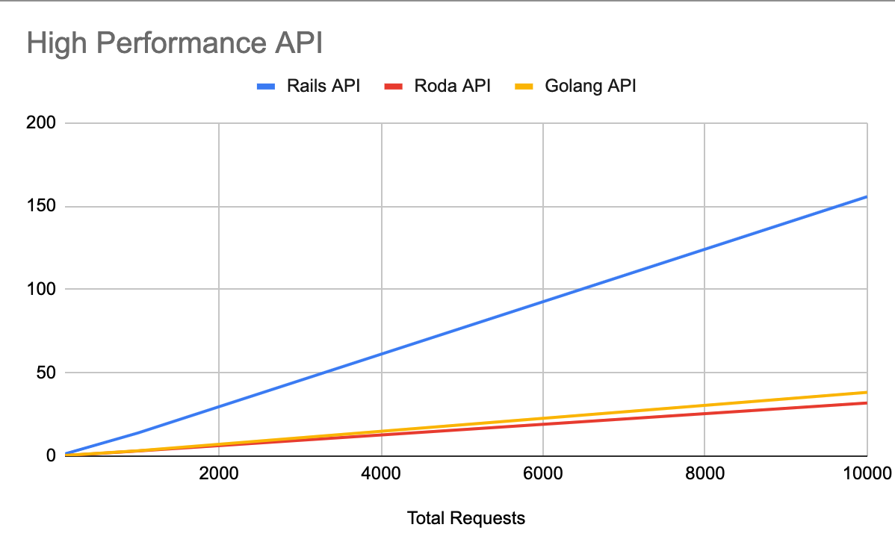

## On High-Performance API Application

Sample scripts to compare speed between stacks.

Currently covered:
- Rails 7 (Ruby 3.1.2)
- Roda (Ruby 3.1.2)
- Go with Gin Framework (Go 1.18.4)

Database:
- Mysql 14.14

## Setup DB && Running the API servers

Setup the DB with: 

```sh
$ make install
```

Running the Rails server (listen at http:3000)

```sh
$ make rails-server
```

Running the Go server (listen at http:8080)

```sh
$ make go-server
```

Running the Roda server (listen at http:9292)

```sh
$ make roda-server
```

Running the benchmarks:

```sh
$ R=123 make on-rails
$ R=123 make on-go
$ R=123 make on-roda
```

`R` is a total request.

## Benchmarks Result



## Snippets of Code

### Rails API

I'm using Rails API-only code base with a setup connection pool of 148.

```yml
# database.yml
default: &default
  adapter: mysql2
  encoding: utf8mb4
  pool: 148
  # ...
```

Nothing fancy in `config/routes.rb`:

```rb
# config/routes.rb
Rails.application.routes.draw do
  resources :messages, only: %i[create]
end
```

Also, in the controllers:

```rb
class MessagesController < ApplicationController
  def create
    render json: Message.create!(message: 'Hello posting from Rails'), status: :ok
  end
end
```

### Roda API

I'm not familiar with Roda, so I just code to make the API server can receive 10000 requests without breaking.

```rb
# config.ru
# ...
Sequel.single_threaded = true
DB = Sequel.connect('mysql2://localhost/golang_test?user=root&password=', max_connections: 10)

class App < Roda
  plugin :json

  route do |r|
    r.is('messages') do
      r.post do
        DB[:messages].insert(message: 'Hello posting from Roda')
        {message: 'Hello posting from Roda'}
      end
    end
  end
end

run App
```

And running it with Puma server. 

```sh
$ bundle exec puma
```

Everything is the default, I don't write this in really performance ways, the DB was using the single-threaded, and using the Puma default settings.


### Go API

```go
// main.go

package main

import (
	"net/http"
	"time"

	"database/sql"

	"github.com/gin-gonic/gin"
	_ "github.com/go-sql-driver/mysql"
)

var db = make(map[string]string)

type Messages struct {
	ID        uint `gorm:"primaryKey"`
	CreatedAt time.Time
	UpdatedAt time.Time
	Message   string
}

func setupRouter() *gin.Engine {
	r := gin.Default()

	r.POST("/messages", func(c *gin.Context) {
		db, err := sql.Open("mysql", "root:@/golang_test")
		if err != nil {
			panic(err)
		}
		// See "Important settings" section.
		db.SetConnMaxLifetime(time.Minute * 3)
		db.SetMaxOpenConns(148)
		db.SetMaxIdleConns(1)
		defer db.Close()

		// perform a db.Query insert
		insert, err := db.Query("INSERT INTO `messages` (`message`) VALUES ('Hello posting from Golang')")

		// if there is an error inserting, handle it
		if err != nil {
			panic(err.Error())
		}
		// be careful deferring Queries if you are using transactions
		defer insert.Close()

		data := map[string]interface{}{
			"message": "Hello posting from Golang",
		}
		c.JSON(http.StatusOK, data)
	})
}

func main() {
	r := setupRouter()
	// Listen and Server in 0.0.0.0:8080
	r.Run(":8080")
}
```

Yes, also the same with Roda, everything that I write is only to make the server is not broken when handling 10000 requests almost at the same time.

## Ping Pong

I try to make ping-pong between Roda and Go, so we exclude the MySQL performance, and here's the result:

```sh
➜  high-performance-bench git:(main) ✗ R=1000 make ping-go
sh bench.sh 1000 http://localhost:8080/ping
Running 1000 iterations for curl http://localhost:8080/ping
Averaged 2.5803 ms in 1000 iterations
Total Time 2.580399 s

➜  high-performance-bench git:(main) ✗ R=1000 make ping-roda
sh bench.sh 1000 http://localhost:9292/ping
Running 1000 iterations for curl http://localhost:9292/ping
Averaged 2.4888 ms in 1000 iterations
Total Time 2.488869 s
```

Again, Roda is slightly better with 0.091 ms. But in this case, Roda doesn't have any logs, while Go writes something in the log for every requets.

## Opinion 

I can say that Ruby is not a poor-performance programming language. Ruby can be fast, and can even be faster than Go in some cases.
 
Poor performance comes when you use Rails, but that not comes without any payback. In developing API-Only in Rails we have [a lot of features](https://guides.rubyonrails.org/api_app.html#why-use-rails-for-json-apis-questionmark) compared to Roda.

In the end, you can take a look at Roda, it's probably a good choice when you care about performance, and still want to use Ruby. 
